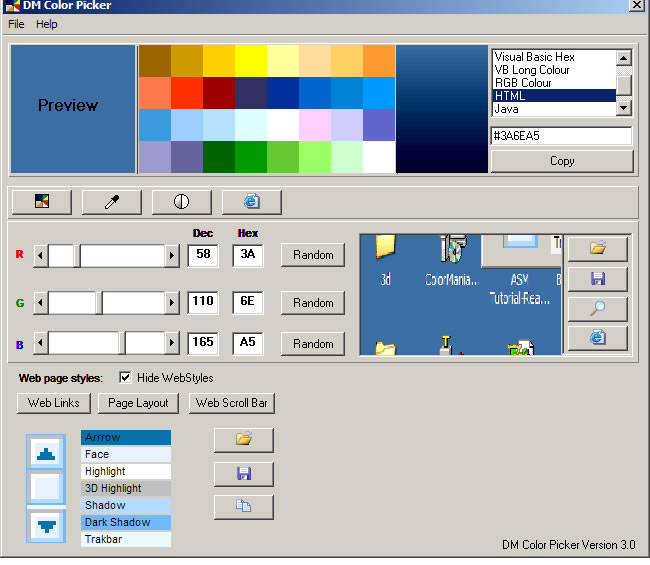



## DM Color Picker Version 3 \- Final

### Description

Hi this is a new update of my Color picker. yer I know you seem them all before but this ones got a thew extras, Load and save your own custom pallets, Mix colors with scrolls, pick color from dialogs, pick a color from the screen or form a picture, Use Websafe colors, Color output support for VB,Delphi,C++,Java,Photoshop, HTML,RGB. as an Extra you can also create and save web color scheams such as Text and Hyperlinks, Web Page header layouts, and even a Web Color scrollbar maker. that you can also copy the CSS code to patse into your HTML.

Anyway project also comes with some same pallet and Web scheams and colored scrollbar examples.

Hope you find is usfull please vote.
 
### More Info
 

             |
---                |---
**Submitted On**   |2005-06-25 01:40:28
**By**             |[dreamvb](https://github.com/Planet-Source-Code/PSCIndex/blob/master/ByAuthor/dreamvb.md)
**Level**          |Intermediate
**User Rating**    |4.9 (34 globes from 7 users)
**Compatibility**  |VB 6\.0
**Category**       |[Complete Applications](https://github.com/Planet-Source-Code/PSCIndex/blob/master/ByCategory/complete-applications__1-27.md)
**World**          |[Visual Basic](https://github.com/Planet-Source-Code/PSCIndex/blob/master/ByWorld/visual-basic.md)
**Archive File**   |[DM\_Color\_P1905556252005\.zip](https://github.com/Planet-Source-Code/dreamvb-dm-color-picker-version-3-final__1-61333/archive/master.zip)

